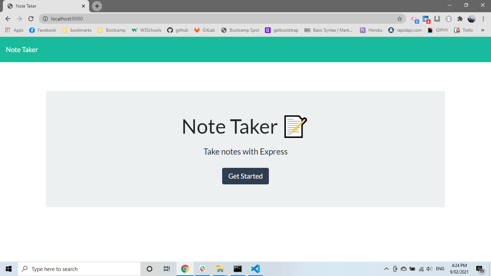
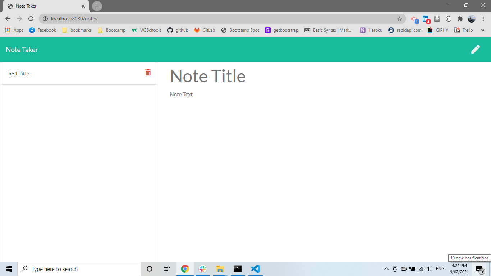
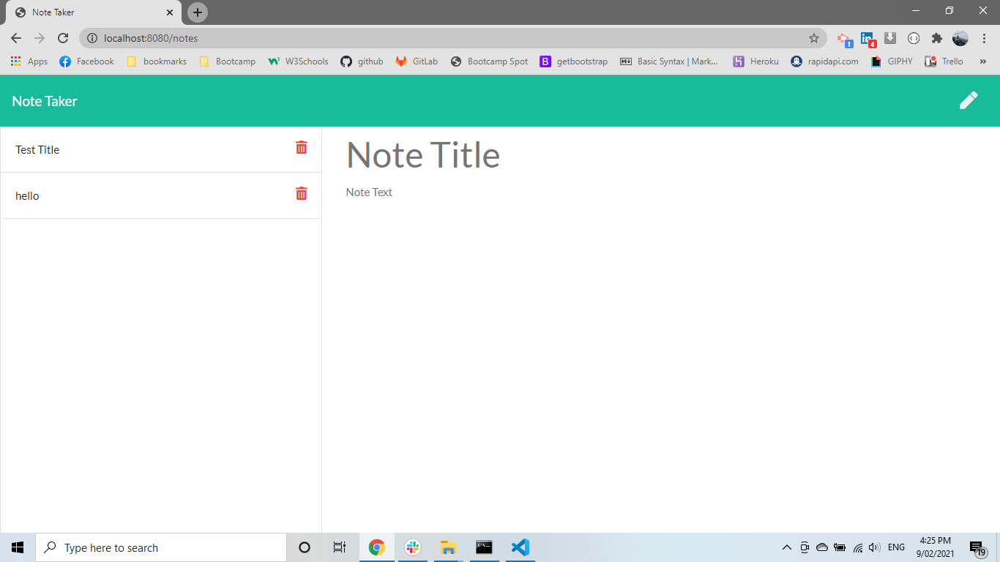
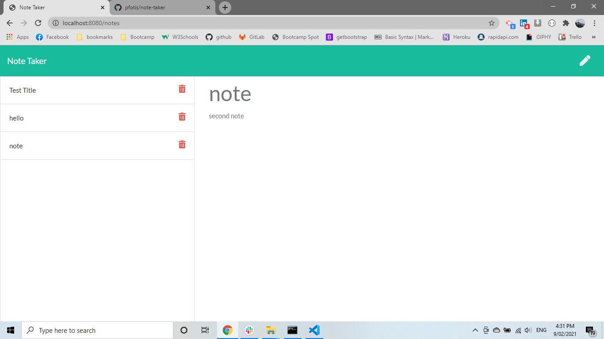
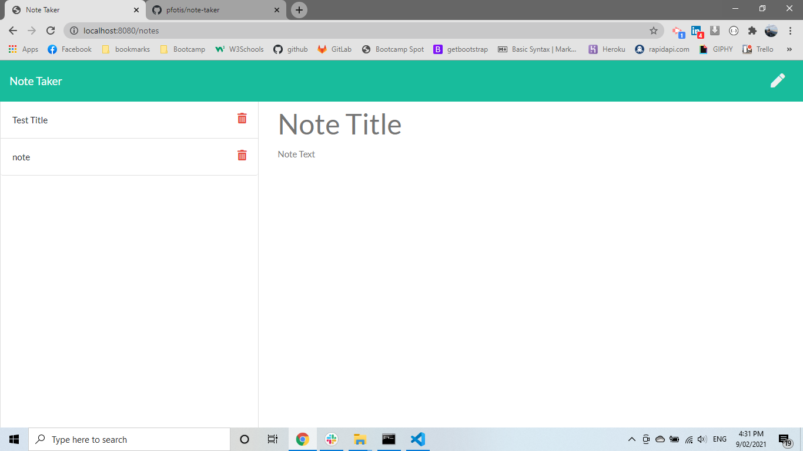

# note-taker

link of repository :   https://github.com/pfotis/note-taker

link of webpage    :   https://arcane-hamlet-40149.herokuapp.com/

This is a project could help the user to store his/her notes in the database in the internet. Could have access from anywhere . 

##  Main page

This is the main page of the website. when the user click at the "Get Started" will have expirience with this app.

## Note

At this page the user could add a note or delete any note from the list or to read any note from the list. The list is at the left side of the screen.

### write a note
When the user click the pen at the right corner top , the user could be able to write a note.

### store the note
As soon as the user type something any bothe section "Note Title" or "Note Text" the user could see a new button the save button. And with this button if the user click on the note will be save.

### read any note
As soonn as the user click of any note in the lefr side the user will able read the note.

### delete any note
when the user click the red bin where is next from any note , that note will be deleted.

